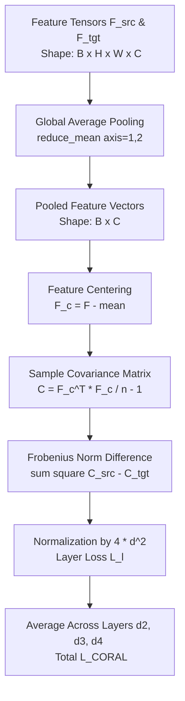

# CORAL (Correlation Alignment) Workflow in cGAN for NTN Channel Estimation

This document provides a comprehensive technical explanation of how **Correlation Alignment (CORAL)** is integrated into the Conditional Generative Adversarial Network (cGAN) in [`run_CORAL_cGAN.py`](file:///c:/Users/AT30890/Hoctap/1_Hprediction/working/H_predict_NTN/Hest_NTN_UDA_clean/CORAL/run_CORAL_cGAN.py) and [`utils_GAN.py`](file:///c:/Users/AT30890/Hoctap/1_Hprediction/working/H_predict_NTN/Hest_NTN_UDA_clean/JMMD/helper/utils_GAN.py).

---

## 1. High-Level Concept: Why CORAL for Channel Estimation?

In 5G Non-Terrestrial Networks (NTN), channel statistics vary significantly across user speeds (e.g., $20\text{--}30\text{ m/s}$ vs. $30\text{--}40\text{ m/s}$), propagation delays, and satellite orbit geometries. This causes a **domain shift**:

* **Source Domain ($\mathcal{D}_{\text{src}}$):** We have labeled data $(X_{\text{src}}, Y_{\text{src}})$ where $X$ is noisy raw channel estimates (`H_li`, `H_ls`, or `H_prac`) and $Y$ is ground truth channel (`H_perfect`).
* **Target Domain ($\mathcal{D}_{\text{tgt}}$):** We only have unlabeled noisy estimates $(X_{\text{tgt}})$.

**CORAL** performs **Unsupervised Domain Adaptation (UDA)** by aligning the **second-order statistics (covariance matrices)** of intermediate feature representations extracted by the generator for both source and target domains.

```
       Source Input X_src  ───► ┌──────────────────────┐ ───► Features F_src ───┐
                                │   Pix2PixGenerator   │                        │
       Target Input X_tgt  ───► │       (UNet)         │ ───► Features F_tgt ───┼──► Compute CORAL Loss
                                └──────────────────────┘                        │    (Align Covariances)
                                           │                                    │
                                           ▼                                    ▼
                               Generated Channel H_est                 Minimize L_CORAL
```

---

## 2. Feature Extraction from the Middle Layers

During the forward pass of the UNet generator (`Pix2PixGenerator`), the network processes input channel tensors of shape `[Batch, Subcarriers=132, TimeSymbols=14, Channels=2]` (Real and Imaginary parts).

### Layer Hierarchy & Extraction Points:
The generator encoder downsamples the spatial resolution while increasing feature channels:

| Layer Name | Type | Output Resolution $(H \times W)$ | Channels ($C$) | Extracted for CORAL? |
| :--- | :--- | :--- | :--- | :--- |
| `down1` (`d1`) | UNet DownBlock 1 | $65 \times 14$ | 32 | No |
| `down2` (`d2`) | UNet DownBlock 2 | $32 \times 14$ | 64 | **Yes** (`extract_layers`) |
| `down3` (`d3`) | UNet DownBlock 3 | $15 \times 14$ | 128 | **Yes** (`extract_layers`) |
| `down4` (`d4`) | UNet Bottleneck | $7 \times 14$ | 256 | **Yes** (`extract_layers`) |
| `up1` (`u1`) | UNet UpBlock 1 | $15 \times 14$ | 128 | Optional |
| `up2` (`u2`) | UNet UpBlock 2 | $32 \times 14$ | 64 | Optional |
| `up3` (`u3`) | UNet UpBlock 3 | $65 \times 14$ | 32 | Optional |
| `last` (`u4`) | Conv2DTranspose | $132 \times 14$ | 2 | Output $\hat{H}$ |

### Forward Pass in Code (`Pix2PixGenerator.call`):
```python
# Forward through Encoder
d1 = self.down1(x, training=training)      # [B, 65, 14, 32]
d2 = self.down2(d1, training=training)     # [B, 32, 14, 64]
d3 = self.down3(d2, training=training)     # [B, 15, 14, 128]
d4 = self.down4(d3, training=training)     # [B,  7, 14, 256]

# Forward through Decoder with skip connections
u1 = self.up1(d4, d3, training=training)
u2 = self.up2(u1, d2, training=training)
u3 = self.up3(u2, d1, training=training)
u4 = self.last(u3)                        # Reconstructed Channel [B, 132, 14, 2]

# Multi-layer feature list returned
features = [d2, d3, d4]
return u4, features
```

When calling `model.generator(x_scaled_src)` and `model.generator(x_scaled_tgt)`:
* `features_src = [f_src_d2, f_src_d3, f_src_d4]`
* `features_tgt = [f_tgt_d2, f_tgt_d3, f_tgt_d4]`

---

## 3. Step-by-Step CORAL Loss Calculation

The CORAL loss is calculated layer-by-layer via `GlobalPoolingCORALLoss` in `utils_GAN.py`.



### Step 1: Global Average Pooling (Spatial Reduction)
To capture channel-wise statistical correlations and remain memory efficient regardless of spatial grid size:
$$\mathbf{f}_{\text{src}} = \frac{1}{H \cdot W} \sum_{h=1}^H \sum_{w=1}^W \mathbf{F}_{\text{src}}(h, w, :) \in \mathbb{R}^{B \times C}$$
$$\mathbf{f}_{\text{tgt}} = \frac{1}{H \cdot W} \sum_{h=1}^H \sum_{w=1}^W \mathbf{F}_{\text{tgt}}(h, w, :) \in \mathbb{R}^{B \times C}$$

```python
source_pooled = tf.reduce_mean(source_feat, axis=[1, 2])  # [B, C]
target_pooled = tf.reduce_mean(target_feat, axis=[1, 2])  # [B, C]
```

### Step 2: Feature Centering (Zero-Mean Normalization)
Subtract the batch mean across samples:
$$\mathbf{F}_c = \mathbf{f} - \frac{1}{B} \sum_{i=1}^B \mathbf{f}_i$$

```python
features_centered = features - tf.reduce_mean(features, axis=0, keepdims=True)
```

### Step 3: Sample Covariance Computation
Compute the $C \times C$ sample covariance matrix:
$$\mathbf{C}_{\text{src}} = \frac{1}{B - 1} \mathbf{F}_{c, \text{src}}^T \mathbf{F}_{c, \text{src}}$$
$$\mathbf{C}_{\text{tgt}} = \frac{1}{B - 1} \mathbf{F}_{c, \text{tgt}}^T \mathbf{F}_{c, \text{tgt}}$$

```python
n = tf.cast(tf.shape(features_centered)[0], tf.float32)
cov_matrix = tf.matmul(features_centered, features_centered, transpose_a=True) / (n - 1)
```

### Step 4: Frobenius Norm Distance
The CORAL loss computes the squared Frobenius norm of the covariance discrepancy, normalized by $4 d^2$ where $d = C$ (feature dimensionality):
$$\mathcal{L}_{\text{CORAL}}^{(l)} = \frac{1}{4 d_l^2} \|\mathbf{C}_{\text{src}}^{(l)} - \mathbf{C}_{\text{tgt}}^{(l)}\|_F^2 = \frac{1}{4 d_l^2} \sum_{i=1}^{C_l} \sum_{j=1}^{C_l} \left( C_{\text{src}, ij}^{(l)} - C_{\text{tgt}, ij}^{(l)} \right)^2$$

```python
source_cov = self.compute_covariance(source_features)
target_cov = self.compute_covariance(target_features)

loss = tf.reduce_sum(tf.square(source_cov - target_cov))
d = tf.cast(source_features.shape[1], tf.float32)
loss = loss / (4.0 * d * d)
```

### Step 5: Multi-Layer Aggregation
Averages the CORAL loss across all extracted layers (`d2`, `d3`, `d4`):
$$\mathcal{L}_{\text{CORAL}} = \frac{1}{L} \sum_{l=1}^L \mathcal{L}_{\text{CORAL}}^{(l)}$$

---

## 4. Integration into the cGAN Multi-Objective Loss

In `train_step_wgan_gp_coral`, the generator minimizes a joint multi-objective loss:

$$\mathcal{L}_G = \lambda_{\text{est}} \mathcal{L}_{\text{MSE}}(Y_{\text{src}}, \hat{X}_{\text{src}}) + \lambda_{\text{adv}} \mathcal{L}_{\text{WGAN}} + \lambda_{\text{domain}} \mathcal{L}_{\text{CORAL}}(\mathbf{F}_{\text{src}}, \mathbf{F}_{\text{tgt}}) + \mathcal{L}_{\text{smooth}}$$

Where:
1. **$\mathcal{L}_{\text{MSE}}(Y_{\text{src}}, \hat{X}_{\text{src}})$:** Supervised channel estimation accuracy on the labeled source domain.
2. **$\mathcal{L}_{\text{WGAN}} = -\mathbb{E}[D(\hat{X}_{\text{src}})]:$** Adversarial critic loss ensuring the generated channels follow realistic 5G channel distributions.
3. **$\mathcal{L}_{\text{CORAL}}$:** Unsupervised alignment pushing the generator to extract domain-invariant representations.
4. **$\mathcal{L}_{\text{smooth}}$:** Physical channel temporal/frequency smoothness penalty.

```python
with tf.GradientTape() as tape_g:
    x_fake_src, features_src = model.generator(x_scaled_src, training=True)
    x_fake_tgt, features_tgt = model.generator(x_scaled_tgt, training=True)
    
    d_fake_src = model.discriminator(x_fake_src, training=False)
    
    g_adv_loss = -tf.reduce_mean(d_fake_src)
    g_est_loss = loss_fn_est(y_scaled_src, x_fake_src)
    coral_loss = coral_loss_fn(features_src, features_tgt)
    
    g_loss = (est_weight * g_est_loss + 
              adv_weight * g_adv_loss + 
              domain_weight * coral_loss + 
              smoothness_loss)

grads_g = tape_g.gradient(g_loss, model.generator.trainable_variables)
gen_optimizer.apply_gradients(zip(grads_g, model.generator.trainable_variables))
```

---

## 5. Summary of Key Files & Symbols

| File | Key Function / Class | Role |
| :--- | :--- | :--- |
| [`CORAL/run_CORAL_cGAN.py`](file:///c:/Users/AT30890/Hoctap/1_Hprediction/working/H_predict_NTN/Hest_NTN_UDA_clean/CORAL/run_CORAL_cGAN.py) | `main()` | Sets up 3-way split, orchestrates training/validation loop, and exports `testChannel_source.mat` and `testChannel_target.mat`. |
| [`JMMD/helper/utils_GAN.py`](file:///c:/Users/AT30890/Hoctap/1_Hprediction/working/H_predict_NTN/Hest_NTN_UDA_clean/JMMD/helper/utils_GAN.py) | `GlobalPoolingCORALLoss` | Implements feature centering, covariance matrix multiplication, and Frobenius norm discrepancy. |
| [`JMMD/helper/utils_GAN.py`](file:///c:/Users/AT30890/Hoctap/1_Hprediction/working/H_predict_NTN/Hest_NTN_UDA_clean/JMMD/helper/utils_GAN.py) | `Pix2PixGenerator` | UNet architecture that extracts `d2`, `d3`, `d4` feature maps. |
| [`JMMD/helper/utils_GAN.py`](file:///c:/Users/AT30890/Hoctap/1_Hprediction/working/H_predict_NTN/Hest_NTN_UDA_clean/JMMD/helper/utils_GAN.py) | `train_step_wgan_gp_coral` | Forward pass on source/target, computes joint loss $\mathcal{L}_G$, and updates weights via gradient descent. |
