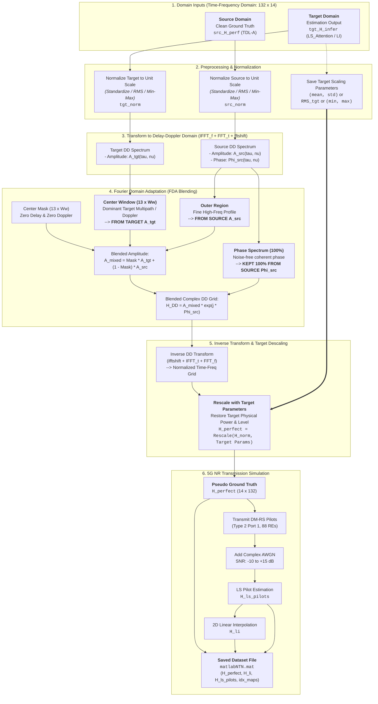

# Pseudo-Channel Dataset Generation via Fourier Domain Adaptation (FDA)

This document provides a detailed explanation of the methodology used in [`pseudoDatasetGen_Perfect_LSAttention.m`](file:///c:/Users/AT30890/Hoctap/1_Hprediction/working/H_predict_NTN/Gene_NTN_Data/pseudoChannel/pseudoDatasetGen_Perfect_LSAttention.m) and [`pseudoDatasetGen_Perfect_LI.m`](file:///c:/Users/AT30890/Hoctap/1_Hprediction/working/H_predict_NTN/Gene_NTN_Data/pseudoChannel/pseudoDatasetGen_Perfect_LI.m) to generate the synthetic **pseudo-channel ground truth** (`H_perfect`) and subsequent 5G NR simulated observations (`H_li`).

---

## 1. Core Concept & Input Data

The goal is **unsupervised domain adaptation (UDA)** in the physical channel domain by borrowing structural multipath and Doppler characteristics from an unlabeled/inferred target domain and injecting them onto clean source channels.

### Inputs for each pair:
1. **Source Sample (Clean Ground Truth):**
   - True channel matrix $H_{\text{src}}$ (`H_perfect` from the source dataset, e.g., NTN TDL-A).
   - High fidelity, noise-free, exact phase and path profile of the source scenario.
2. **Target Sample (Estimation Output on Target Domain):**
   - Output from channel estimation / adaptation on the target domain $H_{\text{tgt}}$:
     - For **LS_Attention**: model-inferred channel $\hat{H}_{\text{LS\_infer}}$ (`H_LS_infer`).
     - For **LI**: baseline 2D linearly-interpolated channel $\hat{H}_{\text{LI}}$ (`H_li`).
   - Reflects the target environment's physical geometry (delay spread, Doppler shift, urban multipath).



---

## 2. Preprocessing & Normalization Workflow

Before computing Fourier transforms, source and target samples often have significantly different energy levels, dynamic ranges, or path loss profiles. Preprocessing normalizes both samples to a common reference scale so that Fourier amplitude mixing does not introduce energy bias.

Depending on `preprocessing_scale`, the pipeline applies:

| Preprocessing Mode | Normalization (Before FDA) | Rescaling / Descaling (After FDA) |
| :--- | :--- | :--- |
| **`"standardize"`** *(Z-score)* | Standardize Real and Imaginary parts independently to **zero mean and unit variance**:$$\tilde{H}_{\text{r}} = \frac{H_{\text{r}} - \mu_{\text{r}}}{\sigma_{\text{r}}}, \quad \tilde{H}_{\text{i}} = \frac{H_{\text{i}} - \mu_{\text{i}}}{\sigma_{\text{i}}}$$ | Rescale pseudo channel using the **Target sample's mean and std**:$$H_{\text{pseudo, r}} = \tilde{H}_{\text{pseudo, r}} \cdot \sigma_{\text{tgt, r}} + \mu_{\text{tgt, r}}$$$$H_{\text{pseudo, i}} = \tilde{H}_{\text{pseudo, i}} \cdot \sigma_{\text{tgt, i}} + \mu_{\text{tgt, i}}$$ |
| **`"rms"`** | Normalize total power of each sample to **unit RMS** ($P = 1.0$):$$\tilde{H} = \frac{H}{\sqrt{\mathbb{E}[|H|^2]}}$$ | Rescale pseudo channel by the **Target sample's RMS power**:$$H_{\text{pseudo}} = \tilde{H}_{\text{pseudo}} \cdot \text{RMS}_{\text{tgt}}$$ |
| **`"minmax"`** | Scale Real and Imaginary parts independently to $[-1, 1]$:$$\tilde{H}_{\text{r}} = 2 \frac{H_{\text{r}} - \min(H_{\text{r}})}{\max(H_{\text{r}}) - \min(H_{\text{r}})} - 1$$ | Rescale with **Target sample's $[\min, \max]$ range**:$$H_{\text{pseudo, r}} = \frac{\tilde{H}_{\text{pseudo, r}} + 1}{2} (\max_{\text{tgt, r}} - \min_{\text{tgt, r}}) + \min_{\text{tgt, r}}$$ |
| **`"none"`** | No preprocessing; applied directly on raw complex values. | No descaling needed. |

> **Key Rule:** The normalization parameters of the **Target sample** are stored and applied to **descale/reconstruct** the output, ensuring the generated pseudo channel adopts the true physical power level and distribution of the target domain.

---

## 3. Delay-Doppler Fourier Domain Adaptation (FDA)

FDA operates in the **Delay-Doppler (DD)** domain, which represents the delay spread and Doppler shift of the channel:

```
Time-Frequency Grid H(f, t)   [132 subcarriers × 14 OFDM symbols]
            │
            ├─ 1. IFFT along Subcarriers (Frequency -> Delay)
            ├─ 2. FFT along Symbols (Time -> Doppler)
            ├─ 3. fftshift (Center DC: Delay=0, Doppler=0 at middle)
            ▼
Delay-Doppler Grid H_DD(τ, ν)
            │
            ├─ Amplitude Spectrum:  A(τ, ν) = |H_DD(τ, ν)|
            └─ Phase Spectrum:      Φ(τ, ν) = angle(H_DD(τ, ν))
```

### What is Kept vs. What is Replaced?

```
               Delay-Doppler Amplitude Plane (centered)
             ┌─────────────────────────────────────────┐
             │                                         │
             │         OUTER REGION                    │
             │    (High Delay / Doppler)               │
             │    -> KEPT FROM SOURCE                  │
             │                                         │
             │           ┌───────────┐                 │
             │           │  CENTER   │                 │
             │           │  WINDOW   │                 │
             │           │ (13 × Ww) │                 │
             │           └───────────┘                 │
             │         -> REPLACED BY TARGET           │
             │                                         │
             └─────────────────────────────────────────┘
```

1. **Center Low-Frequency Amplitude (Window $13 \times w_w$) $\rightarrow$ REPLACED by TARGET:**
   - A rectangular window of size $13 \times w_w$ ($w_w \in \{3, 5\}$) centered at zero delay and zero Doppler is taken from the **Target amplitude spectrum** $A_{\text{tgt}}(\tau, \nu)$.
   - *Physical rationale:* Low-frequency delay-Doppler components represent the dominant path energy, bulk Doppler drift, and major delay spread features unique to the target environment.
2. **Outer High-Frequency Amplitude $\rightarrow$ KEPT from SOURCE:**
   - Elements outside the center window are preserved from the **Source amplitude spectrum** $A_{\text{src}}(\tau, \nu)$.
   - *Physical rationale:* Retains fine multipath structure and prevents high-frequency noise from deteriorating the ground-truth channel.
3. **Phase Spectrum $\rightarrow$ KEPT 100% from SOURCE:**
   - The entire phase angle $\Phi_{\text{src}}(\tau, \nu)$ comes strictly from the **clean Source channel**.
   - *Physical rationale:* The phase contains the spatial/temporal coherence and geometric phase relationships. Inferred target estimates carry estimation noise and phase errors; keeping the clean source phase ensures the synthetic ground truth remains smooth and physically valid.

### Inverse Transform to Time-Frequency Domain:
$$\tilde{A}_{\text{mixed}}(\tau, \nu) = \text{Mask}_{\text{win}} \odot A_{\text{tgt}}(\tau, \nu) + (1 - \text{Mask}_{\text{win}}) \odot A_{\text{src}}(\tau, \nu)$$
$$\tilde{H}_{\text{DD}}(\tau, \nu) = \tilde{A}_{\text{mixed}}(\tau, \nu) \cdot e^{j \Phi_{\text{src}}(\tau, \nu)}$$
$$\tilde{H}_{\text{pseudo}}(f, t) = \text{FFT}_{\text{f}}\Big(\text{IFFT}_{\text{t}}\big(\text{ifftshift}(\tilde{H}_{\text{DD}})\big)\Big)$$

---

## 4. Post-FDA Descaling

After computing $\tilde{H}_{\text{pseudo}}(f, t)$ in the normalized domain:
- The channel is descaled using the target normalization statistics recorded in Section 2 (e.g., target mean and standard deviation for `"standardize"`, or target RMS for `"rms"`).
- This produces the final synthetic ground-truth channel matrix:
  $$H_{\text{perfect}} \in \mathbb{C}^{14 \times 132}$$

---

## 5. 5G NR Transmission Simulation & Observation Generation

Once the pseudo ground-truth $H_{\text{perfect}}$ is created, simulated 5G NR transmission is executed to generate realistic pilot observations and linear interpolation estimates:

1. **Transmit Grid & Pilots:**
   - 5G NR DM-RS Type 2, Port 1 (88 pilot resource elements across OFDM symbols 3 and 12).
2. **Noise Realization:**
   - Given the desired SNR level ($\text{SNR} \in [-10, -5, 0, 5, 10, 15]\text{ dB}$), complex AWGN is added:
     $$Y = X_{\text{DMRS}} \odot H_{\text{perfect}} + N, \quad \sigma_N^2 = \frac{P_{\text{DMRS}}}{10^{\text{SNR}_{\text{dB}}/10}}$$
3. **Least Squares (LS) Pilot Estimation:**
   $$\hat{H}_{\text{LS}}(\text{pilots}) = \frac{Y(\text{pilots})}{X_{\text{DMRS}}(\text{pilots})}$$
4. **2D Linear Interpolation:**
   - $\hat{H}_{\text{LS}}(\text{pilots})$ is interpolated across the $132 \times 14$ grid to yield $H_{\text{li}}$.
5. **Saved Dataset Variables:**
   - Saved in each SNR folder as `matlabNTN.mat`:
     - `H_perfect`: Pseudo ground truth generated by FDA.
     - `H_li`: 2D linearly-interpolated channel from noisy LS pilots.
     - `H_ls_pilots`: Raw LS channel values at pilot positions.
     - `idx_map_source`, `idx_map_target`: Mapping indices linking source and target samples.
