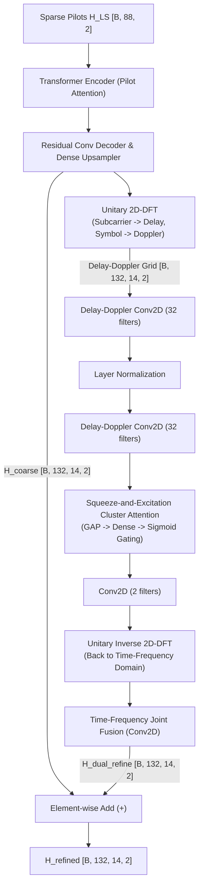

# Dual-Domain (Delay-Doppler 2D-DFT) Refinement Model (`HA02DualDomainModel`)

This document details the **Dual-Domain (Delay-Doppler 2D-DFT) Refinement** channel estimation architecture implemented in [`train_attention_LS_DualDomain.py`](file:///C:/Users/AT30890/Hoctap/1_Hprediction/working/H_predict_NTN/Hest_NTN_UDA_clean/single_dataset/LS_Attention_plus/train_attention_LS_DualDomain.py).

---

## 1. Physical Motivation & Mathematical Formulation

In mobile wireless communication (especially in 5G Non-Terrestrial Networks with high satellite/UE speeds), the physical multipath channel response is composed of a discrete sum of propagation paths:
$$h(t, \tau) = \sum_{p=1}^{P} \alpha_p \cdot e^{j 2\pi f_{d, p} t} \cdot \delta(\tau - \tau_p)$$

* In the **Time-Frequency domain** (subcarriers $\times$ symbols), every multipath component disperses across all resource elements, causing dense constructive/destructive fading.
* In the **Delay-Doppler domain** (obtained via 2D-DFT along the subcarrier and symbol axes), the channel concentrates into **sparse clusters** centered around the physical path delays $\{\tau_p\}$ and Doppler shifts $\{f_{d, p}\}$.

### Discrete 2D-DFT Transformation
For a $132 \times 14$ complex channel grid $\mathbf{H} \in \mathbb{C}^{132 \times 14}$:
$$\mathbf{H}_{\text{DD}} = \mathbf{F}_{132} \mathbf{H} \mathbf{F}_{14}^T$$
where $\mathbf{F}_{132}$ and $\mathbf{F}_{14}$ are normalized unitary Discrete Fourier Transform matrices.

To guarantee complete compatibility with ONNX export, GPU graph compilation, and TensorRT, the 2D-DFT and inverse 2D-DFT are implemented using exact real matrix multiplications:
$$\mathbf{A}_R = \mathbf{F}_{132, R} \mathbf{H}_R - \mathbf{F}_{132, I} \mathbf{H}_I, \quad \mathbf{A}_I = \mathbf{F}_{132, R} \mathbf{H}_I + \mathbf{F}_{132, I} \mathbf{H}_R$$
$$\mathbf{H}_{\text{DD}, R} = \mathbf{A}_R \mathbf{F}_{14, R}^T - \mathbf{A}_I \mathbf{F}_{14, I}^T, \quad \mathbf{H}_{\text{DD}, I} = \mathbf{A}_R \mathbf{F}_{14, I}^T + \mathbf{A}_I \mathbf{F}_{14, R}^T$$

---

## 2. Pipeline Flowchart

---

## 3. Why It Improves the Source Domain

1. **Multipath Cluster Saliency**: In the Delay-Doppler plane, true wireless propagation paths form localized high-energy centroids, while Gaussian noise is spread uniformly across the entire grid.
2. **Channel Attention Soft-Thresholding**: The Squeeze-and-Excitation (SE) gating module automatically attenuates bins with no multipath components, effectively performing dynamic, adaptive denoising that sharpens the CIR (Channel Impulse Response).

---

## 4. Why It Creates a Substantial Domain Gap (For UDA)

1. **Overfitting to Source Delay-Doppler Bins**:
   * The Source domain dataset (e.g. `A100` MATLAB at 70° elevation) has a specific Doppler shift spectrum ($f_{d,\text{max}}$ determined by carrier frequency and orbital geometry) and delay spread profile ($\tau_{\text{max}}$).
   * The convolutional kernels and SE attention weights learn to look for channel energy **strictly inside the specific delay-Doppler bins of the source**.
2. **Domain Mismatch on Target (`A100` $\to$ `DUR100` with 20–30 m/s UE speed)**:
   * When transferred to a Target domain with different user velocity, different elevation angles, or different delay spreads, the true channel energy shifts into different $(k_{\text{delay}}, k_{\text{Doppler}})$ coordinates.
   * Without UDA, the source-tuned Delay-Doppler filter suppresses the target's true multipath paths as out-of-cluster noise!
3. **UDA Opportunity**:
   * Aligning the Delay-Doppler intermediate feature maps (`GAP(x_dd)` `[B, 32]`) forces the network to adapt its spatial cluster attention to the target's Doppler and delay support.

---

## 5. Recommended UDA Alignment Points
* **Primary**: Flattened output of `TransformerEncoderBlock` (`[B, 176]`) $\to$ Projection Head (64-D).
* **Secondary**: Global Average Pooled delay-Doppler features (`gap` `[B, 32]`) $\to$ Projection Head (32-D).
* **Inference**: Single-pass feed-forward execution ($< 1.5\text{ ms}$ via ONNX).
