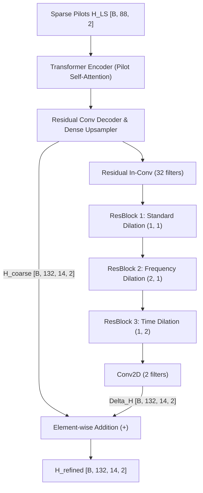

# Two-Stage Residual Error Refinement Model (`HA02ResidualRefineModel`)

This document details the **Two-Stage Residual Error Refinement** channel estimation architecture implemented in [`train_attention_LS_ResidualRefine.py`](file:///C:/Users/AT30890/Hoctap/1_Hprediction/working/H_predict_NTN/Hest_NTN_UDA_clean/single_dataset/LS_Attention_plus/train_attention_LS_ResidualRefine.py), including its mathematical formulation, layer-by-layer structure, and physical justification for Unsupervised Domain Adaptation (UDA).

---

## 1. High-Level Architecture & Concept

The network is composed of two serial stages:
1. **Stage 1 (Coarse Pilot Attention + Grid Upsampling)**: The baseline `HA02Model` maps sparse pilot observations $\mathbf{H}_{\text{LS}} \in \mathbb{R}^{B \times 88 \times 2}$ into an initial full-grid channel prediction $\hat{\mathbf{H}}_{\text{coarse}} \in \mathbb{R}^{B \times 132 \times 14 \times 2}$.
2. **Stage 2 (Multi-Dilation Residual Error Network)**: Rather than reconstructing the channel from scratch, Stage 2 specializes in predicting the systematic **interpolation and edge error**:
   $$\Delta \hat{\mathbf{H}} = f_{\text{refine}}(\hat{\mathbf{H}}_{\text{coarse}})$$
3. **Final Estimate**:
   $$\hat{\mathbf{H}}_{\text{refined}} = \hat{\mathbf{H}}_{\text{coarse}} + \Delta \hat{\mathbf{H}}$$

---

## 2. Layer-by-Layer Specifications

### Stage 1: Coarse Estimator
* **Input**: Sparse LS estimates at pilot locations of shape `[B, 88, 2]`.
* **Encoder (`TransformerEncoderBlock`)**:
  * Linear QKV projection $\to$ 2-Head Self-Attention over 88 pilots $\to$ LayerNorm $\to$ GELU FFN $\to$ LayerNorm $\to$ `[B, 88, 2]`.
* **Decoder (`ResidualConvDecoderBlock`)**:
  * Residual Convolutions $\to$ Dense linear upsampling (`88 -> 1848`) $\to$ Reshape to `[B, 132, 14, 2]`.

### Stage 2: Multi-Dilation Residual Refinement (`ResidualRefineBlock`)
* **Input**: $\hat{\mathbf{H}}_{\text{coarse}}$ `[B, 132, 14, 2]`.
* **Initial Projection**: `Conv2D(32, (3, 3), padding='same')` with LeakyReLU.
* **Dilated ResBlock 1 (Local smoothing)**:
  * `Conv2D(32, 3x3, dilation=(1, 1)) -> LayerNorm -> LeakyReLU -> Conv2D(32, 3x3) + Skip`.
* **Dilated ResBlock 2 (Frequency subcarrier dilation)**:
  * `dilation_rate=(2, 1)`: Skips 2 subcarriers to capture frequency correlation and delay spread components across adjacent subcarrier intervals.
  * `Conv2D(32, 3x3, dilation=(2, 1)) -> LayerNorm -> LeakyReLU -> Conv2D(32, 3x3) + Skip`.
* **Dilated ResBlock 3 (Time symbol dilation)**:
  * `dilation_rate=(1, 2)`: Skips 2 OFDM symbols to capture Doppler phase rotation dynamics along the time axis.
  * `Conv2D(32, 3x3, dilation=(1, 2)) -> LayerNorm -> LeakyReLU -> Conv2D(32, 3x3) + Skip`.
* **Output Projection**: `Conv2D(2, (3, 3), padding='same')` outputting $\Delta \hat{\mathbf{H}}$ `[B, 132, 14, 2]`.

---

## 3. Physical Justification: Source Improvement & Domain Sensitivity

### Why It Improves the Source Domain
1. **Focus on Hard Residues**: The initial attention-based upsampling produces a smooth, low-pass approximation of the channel. The residual network is relieved of predicting the base channel energy and can allocate 100% of its parameters to reconstructing sharp multipath peaks and edge subcarriers.
2. **Multi-Scale Receptive Field**: Dilated convolutions expand the receptive field without downsampling, allowing the network to incorporate context from pilot locations several subcarriers and symbols away.

### Why It Creates a Strong Domain Gap (Ideal for UDA)
1. **Coupling to Source Pilot Pattern (`p1` vs `p2`)**:
   * The spatial error profile $\Delta \mathbf{H} = \mathbf{H}_{\text{true}} - \hat{\mathbf{H}}_{\text{coarse}}$ is directly determined by the geometry of the pilot positions.
   * On the **Source domain** (e.g. `A100` with default pilot pattern `p1`), the refiner learns where the coarse model tends to overshoot or undershoot between `p1` pilot subcarriers.
   * On the **Target domain** with shifted pilot positions (`p2`), the interpolation errors appear at completely different subcarrier and symbol coordinates. An un-adapted Stage 2 will inject residual corrections in the wrong locations, causing a pronounced drop in target NMSE.
2. **Doppler Phase Mismatch**:
   * Dilated time filters tune their phase responses to the Doppler rate of the source environment. Under differing target mobility (e.g., 20–30 m/s vs fixed LEO velocity), the predicted $\Delta \hat{\mathbf{H}}$ suffers phase misalignment.

---

## 4. Recommended UDA Alignment Strategy

When performing domain adaptation (CORAL, JMMD, or Adversarial):
1. **Layer 1 (Pilot Domain)**: Extract flattened output of Stage 1 `TransformerEncoderBlock` (`[B, 176]`) through a 64-D Projection Head.
2. **Layer 2 (Residual Error Domain)**: Extract the output of `ResBlock 3` (before final projection), apply Spatial GAP $\to$ `[B, 32]` through a second 64-D Projection Head.
3. **Inference**: Fast single forward pass ($< 1.2\text{ ms}$ via ONNX).
