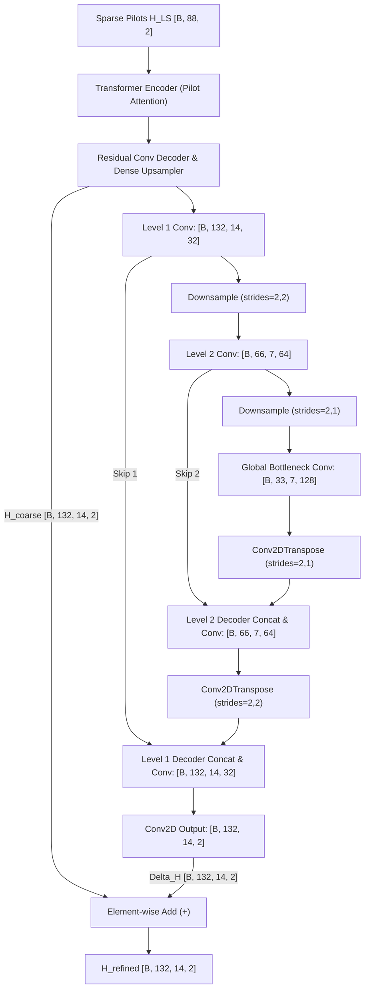

# Multi-Scale U-Net Refinement Model (`HA02UNetRefineModel`)

This document details the **Multi-Scale U-Net Refinement** channel estimation architecture implemented in [`train_attention_LS_UNetRefine.py`](file:///C:/Users/AT30890/Hoctap/1_Hprediction/working/H_predict_NTN/Hest_NTN_UDA_clean/single_dataset/LS_Attention_plus/train_attention_LS_UNetRefine.py).

---

## 1. Physical Motivation & Multi-Scale Receptive Field

Standard convolutional refinement blocks (like `SameShapeBlock` or small $3 \times 3$ filters) have a strictly local receptive field ($\approx 7 \sim 9$ subcarriers). In wireless OFDM systems:
* **Multipath Delay Spread ($T_d$)** induces frequency-selective fading that spans across large groups of subcarriers.
* **Doppler Shifts ($f_d$)** create coherent phase trajectories spanning across the entire 14 OFDM symbols of a radio slot.

To capture slot-wide spatial and temporal correlations without losing fine subcarrier-level resolution, the **U-Net architecture** employs:
1. **Contracting Path (Encoder)**: Progressively aggregates spatial context and compresses the time-frequency grid into a low-dimensional bottleneck.
2. **Global Bottleneck**: A feature representation with a receptive field that encompasses the entire $132 \times 14$ slot.
3. **Expanding Path (Decoder) + Skip Connections**: Reconstructs fine details by directly concatenating high-resolution spatial maps from the contracting path.

---

## 2. Pipeline Flowchart & Tensor Dimensions

### Exact Dimension Alignment
* **Level 1**: Input $132 \times 14 \times 2 \to$ Features $132 \times 14 \times 32$.
* **Down 1**: Conv2D strides $(2, 2) \to 66 \times 7 \times 64$.
* **Down 2**: Conv2D strides $(2, 1) \to 33 \times 7 \times 128$.
* **Bottleneck**: $33 \times 7 \times 128$.
* **Up 2**: Conv2DTranspose strides $(2, 1) \to 66 \times 7 \times 64$ (exact match with Level 2 skip connection).
* **Up 1**: Conv2DTranspose strides $(2, 2) \to 132 \times 14 \times 32$ (exact match with Level 1 skip connection).

---

## 3. Why It Improves the Source Domain

1. **Global Receptive Field**: The bottleneck ($33 \times 7$ with $128$ filters) sees the whole OFDM slot, allowing the network to accurately model the continuous Doppler trajectory across all 14 symbols.
2. **Phase-Preserving Skip Connections**: High-frequency subcarrier phase variations bypass the downsampling bottleneck via skip connections, avoiding blurriness in the estimated channel frequency response (CFR).

---

## 4. Why It Creates a Domain Gap (Ideal for UDA)

1. **Bottleneck Domain Memorization**:
   * The bottleneck compresses the global covariance structure of the Source domain (carrier frequency, elevation angle, velocity distribution).
   * When tested on a Target domain with mismatched Doppler velocity or delay spreads, the low-dimensional bottleneck representation suffers severe distribution shift, reducing target NMSE.
2. **Prime Site for Projection-Head UDA**:
   * The bottleneck feature tensor `bn` (`[B, 33, 7, 128]`) is the **single most effective UDA alignment point** in the entire network.
   * Applying Spatial Global Average Pooling $\bar{\mathbf{z}} = \text{GAP}(\mathbf{Z}_{\text{bn}}) \in \mathbb{R}^{B \times 128}$ and aligning it via a Projection Head (`128 -> 128 -> 64`) directly transfers global channel statistics from Source to Target!

---

## 5. Recommended UDA Alignment Strategy
* **Layer 1 (Pilot Domain)**: `TransformerEncoderBlock` output (`[B, 176]`) $\to$ Projection Head (64-D).
* **Layer 2 (Global Bottleneck Domain)**: `GAP(bn)` (`[B, 128]`) $\to$ Projection Head (64-D).
* **Inference**: Single-pass feed-forward execution ($< 1.5\text{ ms}$ via ONNX).
