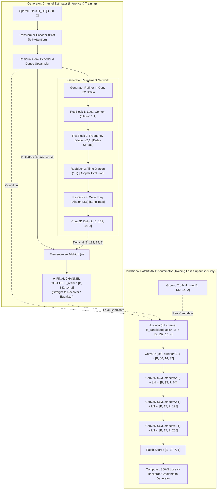

# Conditional GAN Channel Estimation & Refinement Model (`HA02cGANGeneratorModel`)

This document details the **Attention + Conditional GAN (cGAN) Refinement** channel estimation architecture implemented in [`train_attention_LS_cGAN.py`](file:///c:/Users/AT30890/Hoctap/1_Hprediction/working/H_predict_NTN/Hest_NTN_UDA_clean/single_dataset/LS_Attention_plus/train_attention_LS_cGAN.py), covering its physical motivation, mathematical formulation, network architecture, adversarial dynamics, and justification for Unsupervised Domain Adaptation (UDA).

---

## 1. Physical Motivation: Overcoming the Regression Blurring Trap

Standard deep-learning channel estimators rely exclusively on element-wise regression objectives ($\mathcal{L}_{\text{MSE}}$, $\mathcal{L}_{\text{Huber}}$). In high-mobility 5G Non-Terrestrial Networks (NTN):
1. **Regression Blurring (Minimum Mean Square Error Effect)**: Under multipath fading and Doppler phase noise, minimizing $L_2$ error forces the network to predict the conditional mathematical expectation $\mathbb{E}[\mathbf{H} \mid \mathbf{H}_{\text{LS}}]$. Because the phase rotates rapidly across subcarriers and OFDM symbols, this averaging dampens sharp multipath peaks and attenuates high-frequency delay-Doppler components, producing an overly smoothed Channel Frequency Response (CFR).
2. **Channel Estimation as Conditional Distribution Sampling**: The actual physical channel $\mathbf{H}_{\text{true}} \in \mathbb{C}^{132 \times 14}$ is drawn from a true wireless NTN propagation manifold $\mathcal{M}_{\text{NTN}}$ conditioned on sparse pilot observations $\mathbf{H}_{\text{LS}}$:
   $$\mathbf{H} \sim p_{\text{data}}(\mathbf{H} \mid \mathbf{H}_{\text{LS}})$$
3. **The Role of Conditional GAN (cGAN)**: 
   * **Generator ($G$)**: Reconstructs an initial coarse channel from sparse pilots via pilot self-attention and upsampling, then predicts the high-frequency residual correction $\Delta \hat{\mathbf{H}}$.
   * **Conditional Discriminator ($D$)**: Serves as a **learned physics critic**. Given the condition (the coarse estimate $\hat{\mathbf{H}}_{\text{coarse}}$), $D$ examines whether candidate channel realizations exhibit authentic NTN correlation patterns (continuous Doppler phase curves, realistic multipath power delay profiles) or artificial interpolation artifacts.

---

## 2. Pipeline Flowchart & Tensor Dimensions



### Exact Dimension Flow
* **Sparse Pilot Input**: $[B, 88, 2]$ (Real and Imaginary parts of 88 pilot subcarriers).
* **Stage 1 (Coarse Estimation)**: 
  * Self-Attention output: $[B, 88, 2]$.
  * Dense Upsampling + Reshape: $[B, 132, 14, 2]$.
* **Stage 2 (Generator Residual Refinement)**:
  * Dilated ResBlocks output: $[B, 132, 14, 32]$.
  * Final projection: $\Delta \hat{\mathbf{H}} \in [B, 132, 14, 2]$.
  * Refined Channel: $\hat{\mathbf{H}}_{\text{refined}} = \hat{\mathbf{H}}_{\text{coarse}} + \Delta \hat{\mathbf{H}} \in [B, 132, 14, 2]$.
* **Conditional Discriminator Input**:
  * Real pair: $[\hat{\mathbf{H}}_{\text{coarse}}, \mathbf{H}_{\text{true}}] \in [B, 132, 14, 4]$.
  * Fake pair: $[\hat{\mathbf{H}}_{\text{coarse}}, \hat{\mathbf{H}}_{\text{refined}}] \in [B, 132, 14, 4]$.
  * Output: Patch validity grid $[B, 17, 7, 1]$.

---

## 3. Mathematical Formulation & Loss Functions

### 3.1 Least-Squares GAN (LSGAN) Objective
Standard GAN with binary cross-entropy (BCE) frequently suffers from vanishing gradients when evaluating channel estimation errors, leading to mode collapse. We employ the **Least-Squares GAN (LSGAN)** formulation:

1. **Discriminator Objective**:
   $$\min_{\theta_D} \mathcal{L}_D = \frac{1}{2} \mathbb{E}_{\mathbf{H} \sim p_{\text{data}}}\left[\left(D(\hat{\mathbf{H}}_{\text{coarse}}, \mathbf{H}_{\text{true}}) - 1\right)^2\right] + \frac{1}{2} \mathbb{E}_{\mathbf{H}_{\text{LS}}}\left[\left(D(\hat{\mathbf{H}}_{\text{coarse}}, \hat{\mathbf{H}}_{\text{refined}})\right)^2\right]$$

2. **Adversarial Generator Objective**:
   $$\mathcal{L}_{\text{adv}} = \mathbb{E}_{\mathbf{H}_{\text{LS}}}\left[\left(D(\hat{\mathbf{H}}_{\text{coarse}}, \hat{\mathbf{H}}_{\text{refined}}) - 1\right)^2\right]$$

### 3.2 Reconstruction Task Loss (Structural & Point-wise Fidelity)
To guarantee that the generated channel does not hallucinate arbitrary multipath taps and remains faithful to the transmitted symbols, the generator optimizes a compound reconstruction task loss:
$$\mathcal{L}_{\text{task}} = (1 - \alpha_t) \mathcal{L}_{\text{MSE}}(\hat{\mathbf{H}}_{\text{refined}}, \mathbf{H}_{\text{true}}) + \alpha_t \left(1 - \text{SSIM}(\hat{\mathbf{H}}_{\text{refined}}, \mathbf{H}_{\text{true}})\right)$$
* $\alpha_t$: Dynamic SSIM weight scheduled from $\alpha_{\text{start}} = 0.95$ down to $\alpha_{\text{end}} = 0.05$ as training progresses, allowing early structural phase topology learning followed by fine $L_2$ convergence.

### 3.3 Feature Matching Regularization
To stabilize GAN optimization and prevent discriminator overfitting:
$$\mathcal{L}_{\text{FM}} = \frac{1}{L} \sum_{l=1}^L \frac{1}{C_l H_l W_l} \left\| \bar{\mathbf{f}}_l(\hat{\mathbf{H}}_{\text{coarse}}, \mathbf{H}_{\text{true}}) - \bar{\mathbf{f}}_l(\hat{\mathbf{H}}_{\text{coarse}}, \hat{\mathbf{H}}_{\text{refined}}) \right\|_1$$
where $\mathbf{f}_l$ denotes intermediate feature activations from the $l$-th layer of the Discriminator.

### 3.4 Total Generator Loss
$$\mathcal{L}_G = \mathcal{L}_{\text{task}} + \lambda_{\text{adv}} \mathcal{L}_{\text{adv}} + \lambda_{\text{FM}} \mathcal{L}_{\text{FM}}$$
*(Default weights: $\lambda_{\text{adv}} = 0.005$, $\lambda_{\text{FM}} = 0.001$)*.

---

## 4. Layer-by-Layer Specifications

### Generator
1. **Transformer Encoder (`TransformerEncoderBlock`)**:
   * Input: $[B, 88, 2] \to$ Flattened $[B, 176]$.
   * Multi-Head Attention: 2 heads, key/query dimension $d_k = 88$.
   * Scaled dot-product attention + LayerNorm + GELU Feed-Forward Network ($176 \to 352 \to 176$) + LayerNorm.
2. **Dense Upsampler (`ResidualConvDecoderBlock`)**:
   * Initial Conv2D ($2 \times 2$) + Residual Conv2D block + BatchNorm.
   * Transpose & Dense upsampling ($88 \to 1848$).
   * Reshape to $[B, 132, 14, 2]$.
3. **cGAN Residual Refiner (`cGANRefinerBlock`)**:
   * Initial Conv2D (32 filters, $3 \times 3$, LeakyReLU $\alpha = 0.2$).
   * **ResBlock 1**: Conv2D(32, $3 \times 3$, dilation 1) + LayerNorm + Conv2D(32, $3 \times 3$) + Skip.
   * **ResBlock 2**: Conv2D(32, $3 \times 3$, dilation=(2, 1)) + LayerNorm + Conv2D(32, $3 \times 3$) + Skip. Captures multipath frequency coherence across adjacent subcarriers.
   * **ResBlock 3**: Conv2D(32, $3 \times 3$, dilation=(1, 2)) + LayerNorm + Conv2D(32, $3 \times 3$) + Skip. Captures time-varying Doppler phase trajectories across symbols.
   * **ResBlock 4**: Conv2D(32, $3 \times 3$, dilation=(3, 1)) + LayerNorm + Conv2D(32, $3 \times 3$) + Skip. Captures long-delay multipath taps.
   * Output Conv2D(2, $3 \times 3$) predicting $\Delta \hat{\mathbf{H}}$.

### Conditional PatchGAN Discriminator
* **Input**: Concatenation $[\hat{\mathbf{H}}_{\text{coarse}}, \mathbf{H}_{\text{candidate}}]$ of shape $[B, 132, 14, 4]$.
* **Layer 1**: Conv2D(32, kernel=(4, 3), strides=(2, 1), padding='same') $\to [B, 66, 14, 32]$, LeakyReLU(0.2).
* **Layer 2**: Conv2D(64, kernel=(4, 3), strides=(2, 2), padding='same') + LayerNorm $\to [B, 33, 7, 64]$, LeakyReLU(0.2).
* **Layer 3**: Conv2D(128, kernel=(3, 3), strides=(2, 1), padding='same') + LayerNorm $\to [B, 17, 7, 128]$, LeakyReLU(0.2).
* **Layer 4**: Conv2D(256, kernel=(3, 3), strides=(1, 1), padding='same') + LayerNorm $\to [B, 17, 7, 256]$, LeakyReLU(0.2).
* **Patch Output**: Conv2D(1, kernel=(3, 3), strides=(1, 1), padding='same') $\to [B, 17, 7, 1]$.

---

## 5. Physical Justification: Source Improvement & Domain Sensitivity

### Why It Improves the Source Domain
1. **Suppression of Out-of-Distribution Hallucinations**: In low SNR conditions (e.g., 0 dB, -5 dB), least-squares pilot estimates suffer severe noise amplification. The conditional discriminator acts as an adversarial filter, immediately penalizing noisy high-frequency spikes that violate the physical spatial-correlation properties of 3GPP propagation channels.
2. **Sharper Delay Profiles & Edge Subcarriers**: While MSE produces rounded, damped subcarrier edges, the adversarial gradient encourages the generator to output realistic, high-contrast channel frequency variations matching true physical multipath reflections.

### Why It Creates a Strong Domain Gap (Ideal for UDA)
1. **Adversarial Discriminator Memorization**:
   * The conditional discriminator learns the specific delay-Doppler manifold of the Source scenario (e.g., 20–30 m/s user velocity, 70° satellite elevation angle, 200 ns RMS delay spread).
   * The generator is trained specifically to satisfy *this particular discriminator*.
2. **Target Domain Vulnerability**:
   * When deployed on a Target domain with different propagation statistics (e.g., higher Doppler spread from 50–100 m/s mobility, or longer delay spread), the generator attempts to reconstruct channel statistics characteristic of the Source domain.
   * This produces a noticeable domain drop in target NMSE, creating a **clear, well-motivated benchmark for Unsupervised Domain Adaptation (UDA)**.

---

## 6. Recommended UDA Alignment Strategy

When transferring this cGAN model to an unlabelled Target domain:
1. **Layer 1 (Pilot Attention Alignment)**:
   * Extract the flattened output of the Stage 1 `TransformerEncoderBlock` ($[B, 176]$).
   * Feed through a Projection Head (`Dense(128) -> LayerNorm -> GELU -> Dense(64)`).
   * Align Source and Target representations using CORAL (covariance alignment) or Maximum Mean Discrepancy (MMD).
2. **Layer 2 (Generator Refinement Latent Alignment)**:
   * Extract features from `ResBlock 4` of the generator refiner ($[B, 132, 14, 32]$).
   * Apply Global Average Pooling $\to [B, 32]$, then project to 64-D.
   * Aligns the delay-Doppler refinement features across domains.
3. **Layer 3 (Discriminator-Based Domain Adversarial Alignment - DANN)**:
   * Re-purpose the trained Discriminator feature extractor to perform domain classification (Source vs. Target) with a Gradient Reversal Layer (GRL).

---

## 7. Fast Real-Time Inference vs. Diffusion Models

| Metric | Conditional GAN (This Architecture) | Diffusion Models (DDPM / Score-based) |
| :--- | :--- | :--- |
| **Inference Mechanism** | Pure Feed-Forward Generator (Single pass) | Iterative Reverse Denoising ($10 \sim 50$ steps) |
| **Inference Latency** | **$1.0 \sim 1.5\text{ ms}$** (GPU / ONNX Runtime) | **$20 \sim 150\text{ ms}$** |
| **5G NTN Slot Deadline** | **Satisfied** (Standard slot is $0.5\text{ ms}$ at 30 kHz SCS) | **Violated** ($> 40\times$ over deadline) |
| **ONNX Deployment** | Direct export to `best_model.onnx` | Requires complex looped ONNX graphs |
| **Memory Footprint** | $\approx 2.5\text{ MB}$ Generator weights | High memory footprint due to iterative caching |

---

## 8. Quick Start & Execution

```powershell
# 1. Smoke test (5 epochs, small subset)
conda run -n TF_GPU-py3_11 python train_attention_LS_cGAN.py --snr 10 --test-code --save-model

# 2. Full training with standard MinMax scaling
conda run -n TF_GPU-py3_11 python train_attention_LS_cGAN.py --snr 10 --epochs 200 --adv-weight 0.005 --save-model

# 3. Full training with Standardization scaling
conda run -n TF_GPU-py3_11 python train_attention_LS_cGAN.py --snr 10 --standardize --epochs 200 --save-model
```
