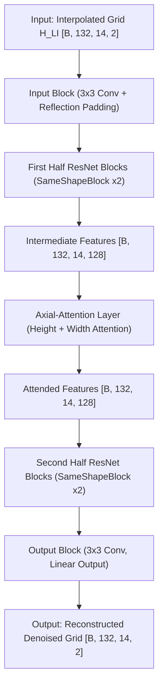
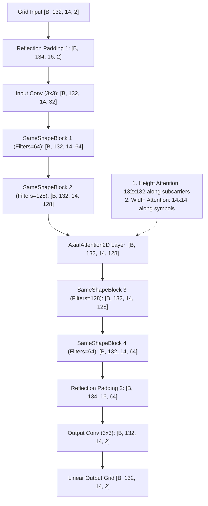
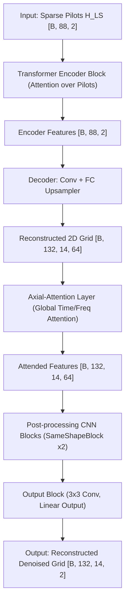

# Axial Self-Attention in OFDM Channel Estimation (OpenNTN)

## 💡 Intuitive Explanation: What Does Axial Attention Actually Do?

Think of an OFDM channel matrix as a **grid of subcarriers (Rows = Height $H$) vs. OFDM symbols (Columns = Width $W$)**:
* **Rows ($H = 132$)**: Frequency domain.
* **Columns ($W = 14$)**: Time domain.

Standard 2D attention looks at **every single cell in the 2D grid relative to every other cell at once**. This is computationally explosive ($1848 \times 1848 = 3.4$ million pairs per image).

**Axial Attention simplifies this into two intuitive, sequential steps:**

---

### Step 1: Subcarrier / Frequency Scanning (Height Attention)
* **What it does intuitively**: For each column (OFDM symbol), the model looks up and down all 132 subcarriers. It asks: *"Given the multipath delay spread, how does subcarrier $A$ correlate with subcarrier $B$?"*
* **Output ($\text{out}_h$)**: A frequency-corrected feature map of the exact same size $[B, H, W, C]$.
* **The role of $\gamma_h$**: $\gamma_h$ is a **trainable "volume knob" (gate parameter)**. It starts at `0.0` at epoch 0 so the network isn't overwhelmed by attention noise. As training progresses, the network learns to turn up $\gamma_h$ to inject just the right amount of frequency-domain context.
* **Intermediate update**:
  $$x_1 = x_{\text{in}} + \gamma_h \cdot \text{out}_h$$

---

### Step 2: Symbol / Time Scanning (Width Attention)
* **What it does intuitively**: Now taking the frequency-refined grid $x_1$, for each row (subcarrier), the model looks left and right across all 14 OFDM symbols in time. It asks: *"Given the satellite/UE movement (Doppler shift), how is the channel evolving from symbol 1 to symbol 14?"*
* **Output ($\text{out}_w$)**: A time-corrected feature map of size $[B, H, W, C]$.
* **The role of $\gamma_w$**: $\gamma_w$ is the **second trainable "volume knob" (gate parameter)** for the time dimension, also initialized to `0.0`.
* **Final update**:
  $$x_{\text{out}} = x_1 + \gamma_w \cdot \text{out}_w = x_{\text{in}} + \gamma_h \cdot \text{out}_h + \gamma_w \cdot \text{out}_w(x_1)$$

---

### ❓ Is it a Skip Connection? ($x_{\text{out}} = x_{\text{in}} + \gamma_h \cdot \text{out}_h + \gamma_w \cdot \text{out}_w$)

**Yes, exactly!** It uses a **gated residual skip connection**. 

1. **Residual Addition**: The original feature map $x_{\text{in}}$ is preserved and directly added to the attention refinements. This guarantees that basic channel features aren't lost.
2. **Sequential Refinement**:
   - First, frequency context is added: $x_1 = x_{\text{in}} + \gamma_h \cdot \text{out}_h$.
   - Second, time context is added on top of $x_1$: $x_{\text{out}} = x_1 + \gamma_w \cdot \text{out}_w$.
3. **Trainable Gating ($\gamma_h, \gamma_w$)**:
   - At Epoch 0: $\gamma_h = 0, \gamma_w = 0 \implies x_{\text{out}} = x_{\text{in}}$ (pure identity pass-through, fast & stable training startup).
   - At Epoch 100+: $\gamma_h, \gamma_w > 0 \implies$ The network dynamically decides how much frequency vs. time attention to blend in.

---

## Detailed Code Mechanics (`AxialAttention2D`)

The Python class [`AxialAttention2D`](file:///c:/Users/AT30890/Hoctap/1_Hprediction/working/H_predict_NTN/Hest_NTN_UDA_clean/JMMD/helper/utils_GAN.py#L3830-L3912) is executed in two consecutive blocks:

```python
# 1. Height-axis Attention (along subcarriers H)
scores_h = qh @ kh.T                      # [B * W, H, H] -> 132x132 matrix per symbol
attn_h   = softmax(scores_h / sqrt(132))  # Attention weights matrix A_h
out_h    = attn_h @ vh                    # Aggregated frequency features
x        = x + self.gamma_h * out_h       # Residual skip connection with gamma_h

# 2. Width-axis Attention (along OFDM symbols W)
scores_w = qw @ kw.T                      # [B * H, W, W] -> 14x14 matrix per subcarrier
attn_w   = softmax(scores_w / sqrt(14))   # Attention weights matrix A_w
out_w    = attn_w @ vw                    # Aggregated time features
x        = x + self.gamma_w * out_w       # Residual skip connection with gamma_w
```

---

## Summary Comparison: Standard 2D vs. Axial Attention

```
Standard 2D Attention:
Full Grid (1848 REs) ───────────► 1848 x 1848 Heavy Attention Matrix ───► Heavy Memory (OOM Risk)

Axial Attention (Sequential 1D):
Step 1: Subcarrier Axis ───────► 132 x 132 Attention (per symbol)   ───► x = x + gamma_h * out_h
Step 2: Symbol Axis     ───────► 14 x 14 Attention (per subcarrier) ───► x = x + gamma_w * out_w
```

---

## 📐 Full Model Architecture: Grid Input + DnCNN + Axial Attention

The model architecture in [`train_DnCNN_AxialAttention.py`](file:///c:/Users/AT30890/Hoctap/1_Hprediction/working/H_predict_NTN/Hest_NTN_UDA_clean/single_dataset/train_DnCNN_AxialAttention.py) uses the `DnCNN_ResNet_AxialAttention` model. This model takes a full 2D grid input (interpolated Least Squares estimate $\mathbf{H}_{\text{LI}}$ of shape `[B, 132, 14, 2]`) and processes it through a series of residual convolutional blocks, incorporating an `AxialAttention2D` layer in the middle to retrieve long-range spatial and temporal dependencies.

### 1. High-Level Pipeline Flowchart


### 2. Layer-by-Layer Data Flow Details
Assuming the default configuration `n_blocks = 4` and `base_filters = 32`:



### 3. Detailed Block Components
* **`SameShapeBlock` (ResNet Block)**:
  * Each block maintains the spatial shape using manual `reflect_padding_2d` (pad=1) before 3x3 convolutions.
  * Consists of: **Manual Padding** $\rightarrow$ **3x3 Conv** $\rightarrow$ **Instance Norm** $\rightarrow$ **LeakyReLU** $\rightarrow$ **Manual Padding** $\rightarrow$ **3x3 Conv** $\rightarrow$ **Instance Norm** $\rightarrow$ **Residual Add (with 1x1 Conv channel projection if input/output filter sizes differ)** $\rightarrow$ **LeakyReLU**.
* **Linear Output Layer**:
  * The final output `Conv2D` layer uses a linear activation function (no activation) to allow estimated coefficients to range freely beyond scaling boundaries.


---

## 📐 Full Model Architecture: LS Sequence Input + HA02 + Axial Attention

The model architecture in [`train_attention_LS_axialAttention.py`](file:///c:/Users/AT30890/Hoctap/1_Hprediction/working/H_predict_NTN/Hest_NTN_UDA_clean/single_dataset/train_attention_LS_axialAttention.py) uses the `HA02Model` hybrid architecture. Unlike the grid input model which works directly on 2D grids, this model takes **sparse pilot sequence measurements** ($\mathbf{H}_{\text{LS}}$ of shape `[B, 88, 2]`) and performs self-attention over the pilot values, upsamples them to a 2D grid, and applies `AxialAttention2D` followed by CNN post-processing.

### 1. High-Level Pipeline Flowchart


### 2. Layer-by-Layer Data Flow Details
Assuming the default configuration `n_filter = 32` (giving `64` channels) and `num_heads = 2`:

```mermaid
graph TD
    In["Sparse Input [B, 88, 2]"]
    --> Flat["Flat: [B, 176]"]
    --> QKV["QKV Projection: [B, 528]"]
    --> Attn["Self-Attention & Softmax: [B, 2, 88, 88]"]
    --> AddNorm1["Layer Norm 1 (Add Residual): [B, 176]"]
    --> FFN["Feed-Forward (GELU): [B, 352] -> [B, 176]"]
    --> AddNorm2["Layer Norm 2 (Add Residual): [B, 176]"]
    --> ReshapeEnc["Reshape back: [B, 88, 2]"]
    
    ReshapeEnc --> ExpDim["Expand Dim: [B, 88, 2, 1]"]
    ExpDim --> Conv1["Conv2D (Filters=32): [B, 88, 2, 32]"]
    Conv1 --> ResConv["2x Conv2D (Residual): [B, 88, 2, 32]"]
    ResConv --> AddNorm3["Batch Norm (Add Residual): [B, 88, 2, 32]"]
    
    AddNorm3 --> Transpose1["Transpose: [B, 32, 2, 88]"]
    Transpose1 --> FCUpsample["FC Dense Upsample: [B, 32, 2, 1848]"]
    FCUpsample --> Transpose2["Transpose Back: [B, 1848, 2, 32]"]
    
    Transpose2 --> ReshapeGrid["Reshape Grid: [B, 132, 14, 2, 32]"]
    ReshapeGrid --> FlatGrid["Flat Grid Channels: [B, 132, 14, 64]"]
    
    FlatGrid --> AxialAttnLayer["AxialAttention2D Layer: [B, 132, 14, 64]"]
    AxialAttnLayer --> Blk1["SameShapeBlock 1 (Filters=64): [B, 132, 14, 64]"]
    Blk1 --> Blk2["SameShapeBlock 2 (Filters=32): [B, 132, 14, 32]"]
    
    Blk2 --> Pad2["Reflection Padding: [B, 134, 16, 32]"]
    Pad2 --> ConvOut["Output Conv (3x3): [B, 132, 14, 2]"]
    ConvOut --> Out["Linear Output Grid [B, 132, 14, 2]"]
```



### 3. Detailed Hybrid Components
* **`TransformerEncoderBlock` (Pilot Attention Pre-processor)**:
  * Computes self-attention over the flattened sequence representation of pilot positions to capture relationships across pilot coordinates before upsampling.
* **`ResidualConvDecoderBlock` (Upsampling & Reconstruction)**:
  * Maps pilot features from the 1D pilot dimension ($88$) to the full time-frequency slot dimension ($132 \times 14 = 1848$) via a transposed projection (`fc_upsample`), and reshapes it to a 2D spatial grid.
* **`AxialAttention2D` & Post-Processing (`SameShapeBlock`s)**:
  * Applies global axial self-attention to the reconstructed grid features to handle delay-Doppler context.
  * Followed by 2 `SameShapeBlock`s for denoising, local smoothing, and non-linear blending of global context.

---

## Why This Helps Wireless Channel Estimation in NTN

1. **Frequency Selectivity (Delay Spread $T_d$)**: Height attention captures subcarrier correlations caused by multipath reflections across the 132 subcarriers.
2. **Time Selectivity (Doppler Shift $f_d$)**: Width attention captures time variations caused by high-speed satellite/UE movement across 14 OFDM symbols.
3. **12.65× Efficiency Gain**: Reduces attention matrix elements from $1848^2 = 3.41 \times 10^6$ down to $(14 \times 132^2 + 132 \times 14^2) = 269,808$, preventing GPU memory crashes while maintaining global receptive fields.
