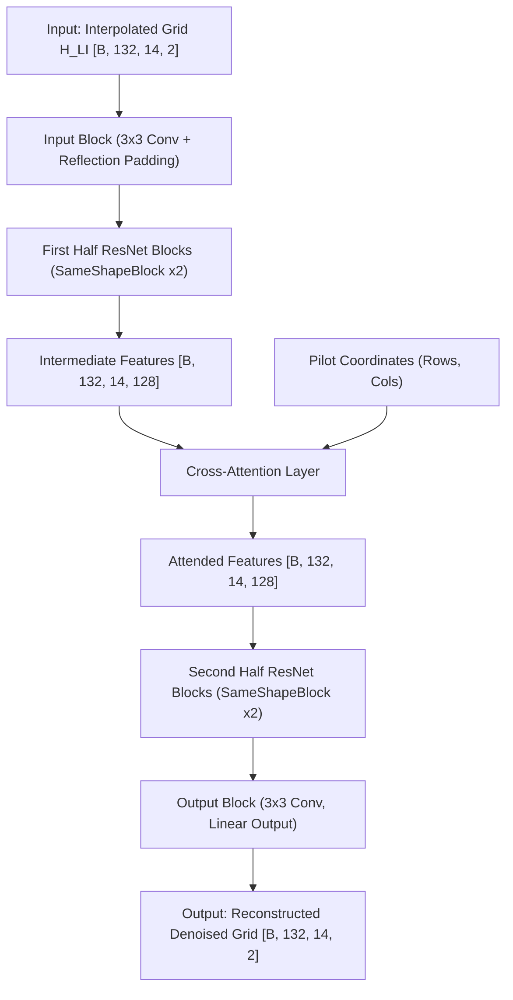
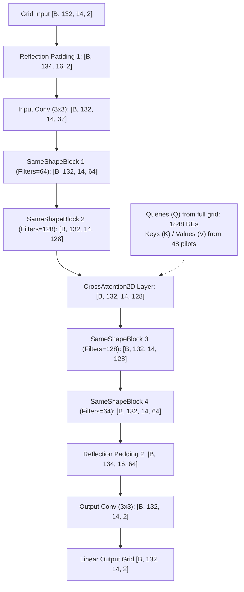

# Cross-Attention in OFDM Channel Estimation (OpenNTN)

## Overview & Context

In Non-Terrestrial Network (NTN) wireless systems, pilot symbols (known reference signals) are transmitted at specific subcarrier and symbol coordinates within the time-frequency resource grid $\mathbf{H} \in \mathbb{C}^{N_{\text{subc}} \times N_{\text{symb}}}$ ($132 \times 14$).

The script [`train_DnCNN_CrossAttention.py`](file:///c:/Users/AT30890/Hoctap/1_Hprediction/working/H_predict_NTN/Hest_NTN_UDA_clean/single_dataset/train_DnCNN_CrossAttention.py) uses the model `DnCNN_ResNet_CrossAttention`, which incorporates the **`CrossAttention2D`** layer defined in [`utils_GAN.py`](file:///c:/Users/AT30890/Hoctap/1_Hprediction/working/H_predict_NTN/Hest_NTN_UDA_clean/JMMD/helper/utils_GAN.py#L3987-L4071).

Unlike standard Self-Attention (where every point on the grid attends to every other point), **Cross-Attention** allows every point on the 2D channel grid to explicitly query and extract high-fidelity features from the **exact pilot positions**.

---

## What Does the Cross-Attention Layer Do?

In wireless channel estimation, pilot Resource Elements (REs) contain clean, uncorrupted ground-truth reference measurements, whereas non-pilot data REs must be interpolated and denoised.

**`CrossAttention2D`** decouples the Queries ($Q$) from Keys ($K$) and Values ($V$):
* **Queries ($Q$)**: Projected from **all points across the entire 2D resource grid** ($H \times W = 132 \times 14 = 1848$ REs).
* **Keys ($K$) and Values ($V$)**: Projected **exclusively from the features gathered at pilot coordinates** ($P$ pilot REs).

```
Full Feature Map [B, H, W, C] ───────────► Query Conv (1x1) ───► Q [B, H*W, d_k]
          │                                                          │
          ▼ Gather at Pilot Coords (p_rows, p_cols)                  │ (MatMul Q x K^T)
   Pilot Features [B, P, C]                                          │ Attention Map
          ├──────────────────────────────► Key Dense  ─────────► K [B, P, d_k] ───┘  [B, H*W, P]
          │                                                                           │
          └──────────────────────────────► Value Dense ────────► V [B, P, C]  ◄───────┘
                                                                               (MatMul Attn x V)
                                                                                       │
                                                                                       ▼
Output Feature Map [B, H, W, C] ◄────── Residual Add (gamma * out) ◄───── Reshape back [B, H, W, C]
```

---

### Mathematical & Algorithmic Breakdown

Given an intermediate feature tensor $\mathbf{X} \in \mathbb{R}^{B \times H \times W \times C}$ and pilot coordinates $\{(r_p, c_p)\}_{p=1}^P$:

#### Step 1: Pilot Feature Extraction (`tf.gather_nd`)
Features are gathered exclusively at the $P$ pilot coordinates across the batch:
$$\mathbf{F}_{\text{pilot}} = \text{Gather}_{\text{nd}}(\mathbf{X}, \text{coords}) \in \mathbb{R}^{B \times P \times C}$$

#### Step 2: Projection Operations
* **Query Projection** ($1 \times 1$ Conv on full grid):
  $$\mathbf{Q} = \text{Reshape}\left(\text{Conv2D}_{1\times1}(\mathbf{X})\right) \in \mathbb{R}^{B \times (HW) \times d_k}$$
  *(where $d_k = C / 8$)*.
* **Key Projection** (Dense layer on pilot features):
  $$\mathbf{K} = \text{Dense}(\mathbf{F}_{\text{pilot}}) \in \mathbb{R}^{B \times P \times d_k}$$
* **Value Projection** (Dense layer on pilot features):
  $$\mathbf{V} = \text{Dense}(\mathbf{F}_{\text{pilot}}) \in \mathbb{R}^{B \times P \times C}$$

#### Step 3: Attention Weighting & Context Aggregation
* **Cross-Attention Matrix Calculation**:
  $$\mathbf{S} = \frac{\mathbf{Q} \mathbf{K}^T}{\sqrt{d_k}} \in \mathbb{R}^{B \times (HW) \times P}$$
  $$\mathbf{A} = \text{Softmax}(\mathbf{S}, \text{axis}=-1) \in \mathbb{R}^{B \times (HW) \times P}$$
  *(Each row $i$ of $\mathbf{A}$ represents how strongly data RE $i$ relies on pilot $j$)*.

* **Weighted Aggregation & Reshape**:
  $$\mathbf{Y} = \mathbf{A} \mathbf{V} \in \mathbb{R}^{B \times (HW) \times C} \xrightarrow{\text{reshape}} \mathbb{R}^{B \times H \times W \times C}$$

* **Gated Residual Update**:
  $$\mathbf{X}_{\text{out}} = \mathbf{X} + \gamma \cdot \mathbf{Y}$$
  *(where $\gamma$ is a trainable weight initialized to $0.0$)*.

---

## 📐 Full Model Architecture: Grid Input + DnCNN + Cross-Attention

The model architecture in [`train_DnCNN_CrossAttention.py`](file:///c:/Users/AT30890/Hoctap/1_Hprediction/working/H_predict_NTN/Hest_NTN_UDA_clean/single_dataset/train_DnCNN_CrossAttention.py) uses the `DnCNN_ResNet_CrossAttention` model. This model takes a full 2D grid input (interpolated Least Squares estimate $\mathbf{H}_{\text{LI}}$ of shape `[B, 132, 14, 2]`) and processes it through a series of residual convolutional blocks, incorporating a `CrossAttention2D` layer in the middle to retrieve exact pilot features.

### 1. High-Level Pipeline Flowchart


### 2. Layer-by-Layer Data Flow Details
Assuming the default configuration `n_blocks = 4` and `base_filters = 32`:



### 3. Detailed Block Components
* **`SameShapeBlock` (ResNet Block)**:
  * Each block maintains the spatial shape using manual `reflect_padding_2d` (pad=1) before 3x3 convolutions.
  * Consists of: **Manual Padding** $\rightarrow$ **3x3 Conv** $\rightarrow$ **Instance Norm** $\rightarrow$ **LeakyReLU** $\rightarrow$ **Manual Padding** $\rightarrow$ **3x3 Conv** $\rightarrow$ **Instance Norm** $\rightarrow$ **Residual Add (with 1x1 Conv channel projection if input/output filter sizes differ)** $\rightarrow$ **LeakyReLU**.
* **Linear Output Layer**:
  * The final output `Conv2D` layer uses a linear activation function (no activation) to allow estimated coefficients to range freely beyond scaling boundaries.

---

## How Is Cross-Attention Helpful for Wireless Channel Estimation?

### 1. Direct Information Highway from Pilots to Data REs
* In conventional CNNs, pilot information propagates gradually to distant data REs layer-by-layer through local $3 \times 3$ convolutions.
* Cross-Attention provides a **direct, single-step link** between every data subcarrier/symbol and the pilot anchors. Any location on the grid can dynamically query the most relevant pilots based on delay-Doppler correlation.

### 2. Massive Computational & Memory Efficiency (~38.5× Reduction)
For an OFDM resource grid of $H = 132$ subcarriers and $W = 14$ symbols ($HW = 1848$ REs) with $P = 48$ pilots:

| Parameter / Metric | Full 2D Self-Attention | Pilot Cross-Attention | Improvement |
| :--- | :--- | :--- | :--- |
| **Attention Matrix Dimensions** | $[B, 1848, 1848]$ | $[B, 1848, P]$ (e.g. $[B, 1848, 48]$) | **Focused Attention** |
| **Pairwise Comparisons per Sample** | $1848 \times 1848 = 3,415,104$ | $1848 \times 48 = 88,704$ | **38.5× fewer operations** |
| **Memory Footprint** | Extremely high (OOM risk) | Very lightweight | Highly scaleable |

### 3. Exploits Pilot Physics & Domain Knowledge
* Pilot positions in 5G NR / NTN are fixed physical reference points.
* Instead of wasting compute matching data REs to other noisy data REs, Cross-Attention forces the model to attend directly to known pilot reference signals, anchoring the channel estimation around real physical measurements.

### 4. Smooth Training Convergence ($\gamma = 0.0$ Gate)
* $\gamma$ is initialized to $0.0$, allowing the model to act as a standard ResNet initially.
* The optimizer gradually increases $\gamma$, steadily introducing cross-attention pilot context without disrupting early training stability.

---

## Summary Table

| Feature | Description |
| :--- | :--- |
| **Implementation** | `CrossAttention2D` in `utils_GAN.py` used by `DnCNN_ResNet_CrossAttention` |
| **Target Grid** | $132 \text{ subcarriers} \times 14 \text{ OFDM symbols} \times 2 \text{ channels (Real/Imag)}$ |
| **Queries ($Q$)** | Full 2D resource grid ($132 \times 14 = 1848$ REs) |
| **Keys ($K$) / Values ($V$)** | Features at sparse pilot coordinates $P$ extracted via `tf.gather_nd` |
| **Key Advantage** | Direct pilot-to-grid information retrieval with 38.5× lower compute than full self-attention |
