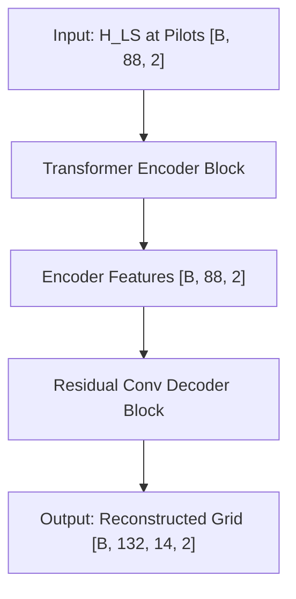

# HA02 Attention Model: Architecture & Data Flow (OpenNTN)

## 💡 Overview: How HA02 Reconstructs the Channel Grid

The **HA02 Model** (`HA02Model`) is a deep learning-based channel estimator designed to take sparse pilot measurements (Least Squares estimates at pilot positions) and reconstruct the complete, dense 2D channel coefficient grid (Subcarriers × OFDM symbols).

Its architecture is divided into two main stages:
1. **Transformer Encoder Block (Attention Pre-processor)**: Computes relationships and dependency weights across the sparse pilot values to capture spatial/spectral context.
2. **Residual Convolutional Decoder Block (Decoder + Upsampler)**: Refines the features, upsamples them to match the total grid dimensions, and uses convolutional layers to output the reconstructed grid.

---

## 📐 Block Diagrams

### 1. High-Level Architecture

### 2. Detailed Data Flow & Dimensions

```mermaid
graph TD
    Input["Input: [B, 88, 2]"] 
    --> Flat["Flat: [B, 176]"]
    --> QKV["QKV Dense Projection: [B, 528]"]
    --> Split["Q, K, V Splitting: [B, 2, 88] each"]
    
    Split --> Attn["Self-Attention & Softmax: [B, 2, 88, 88]"]
    Attn --> AttnOut["Attention Out (Squeeze): [B, 2, 88]"]
    AttnOut --> FlatAttn["Flat Attention Out: [B, 176]"]
    FlatAttn --> ProjAttn["FC Out Projection: [B, 176]"]
    
    ProjAttn --> AddNorm1["Layer Norm 1 (Add Residual): [B, 176]"]
    AddNorm1 --> FFN["Feed-Forward (GELU): [B, 352] -> [B, 176]"]
    FFN --> AddNorm2["Layer Norm 2 (Add Residual): [B, 176]"]
    AddNorm2 --> ReshapeEnc["Reshape back: [B, 88, 2]"]
    
    ReshapeEnc --> ExpDim["Expand Dim: [B, 88, 2, 1]"]
    ExpDim --> Conv1["Conv2D (Filters=2): [B, 88, 2, 2]"]
    Conv1 --> ResConv["2x Conv2D (Residual): [B, 88, 2, 2]"]
    ResConv --> AddNorm3["Batch Norm (Add Residual): [B, 88, 2, 2]"]
    
    AddNorm3 --> Transpose1["Transpose: [B, 2, 2, 88]"]
    Transpose1 --> FCUpsample["FC Dense Upsample: [B, 2, 2, 1848]"]
    FCUpsample --> Transpose2["Transpose Back: [B, 1848, 2, 2]"]
    
    Transpose2 --> ConvOut["Conv2D Out (Filters=1): [B, 1848, 2, 1]"]
    ConvOut --> Squeeze["Squeeze: [B, 1848, 2]"]
    Squeeze --> ReshapeOut["Reshape Final: [B, 132, 14, 2]"]
```

---

## 🧩 Component Breakdown

### 1. Transformer Encoder Block (`TransformerEncoderBlock`)
* **Input Shape**: `[B, 88, 2]` (Batch size, 88 pilot elements, 2 channels representing Real and Imaginary parts).
* **Flat Representation**: The input is flattened to `[B, 176]` (where `176 = 88 * 2`).
* **Multi-Head Projection**: A Dense layer maps `176` dimensions to `528` (`3 * 176`). This is split into Query ($Q$), Key ($K$), and Value ($V$) matrices of shape `[B, 2, 88]` (using 2 attention heads).
* **Dimension Self-Attention**:
  * Instead of sequence-level attention, attention is computed along the feature dimension using the outer product of expanded Query and Key vectors.
  * Score shape: `[B, 2, 88, 88]` scaled by $\sqrt{\text{num\_pilot\_elems} / \text{num\_heads}} = \sqrt{44} \approx 6.63$.
  * Softmax is applied to get attention weights, which are multiplied by the Value vector $V$ to get an updated matrix of shape `[B, 2, 88]`.
* **Output Projection & FFN**:
  * The attention output is flattened back to `[B, 176]` and projected using a Dense layer.
  * A standard residual skip connection and Layer Normalization are applied.
  * A Feed-Forward Network (FFN) with two Dense layers (`176 -> 352 -> 176`) and GELU activation adds further capacity.
  * A second residual skip connection and Layer Normalization are applied.
* **Output Shape**: Reshaped back to `[B, 88, 2]`.

### 2. Residual Convolutional Decoder Block (`ResidualConvDecoderBlock`)
* **Input Shape**: `[B, 88, 2]`.
* **Dimension Expansion**: Expanded to `[B, 88, 2, 1]` to prepare for 2D convolutions.
* **Initial 2D Convolution**: Passed through a `Conv2D` layer with 2 filters and a $(2 \times 2)$ kernel to map the features to `[B, 88, 2, 2]`.
* **Residual Block**:
  * The features pass through a residual block containing two `Conv2D` layers (filters=2, kernel size $2 \times 2$) and a `ReLU` activation.
  * The input to the residual block is added back to its output (`h1 + res`), followed by Batch Normalization.
* **Dense/FC Upsampling**:
  * The tensor is transposed to `[B, 2, 2, 88]`.
  * A Dense layer (`fc_upsample`) projects the pilot-dimension size (`88`) to the total grid resource element size (`1848`, representing $132 \text{ subcarriers} \times 14 \text{ OFDM symbols}$).
  * This projects the representation from pilot positions to the entire time-frequency grid.
  * The output is transposed back to `[B, 1848, 2, 2]`.
* **Final Reconstruction**:
  * Passed through an output `Conv2D` layer with 1 filter to merge the channel dimensions (`[B, 1848, 2, 1]`).
  * Squeezed to `[B, 1848, 2]` and reshaped to the final 2D OFDM slot format.
* **Output Shape**: `[B, 132, 14, 2]` (Batch size, 132 subcarriers, 14 symbols, 2 channels).

---

## ⚡ Mathematical Grid Alignment

* **Subcarriers ($N_{sc}$)**: $132$
* **OFDM Symbols ($N_{symb}$)**: $14$
* **Total Resource Elements (REs)**: $132 \times 14 = 1848$
* **Pilots ($N_{pilot}$)**: $88$
* **Upsampling Ratio**: $\frac{1848}{88} = 21\times$ expansion.
